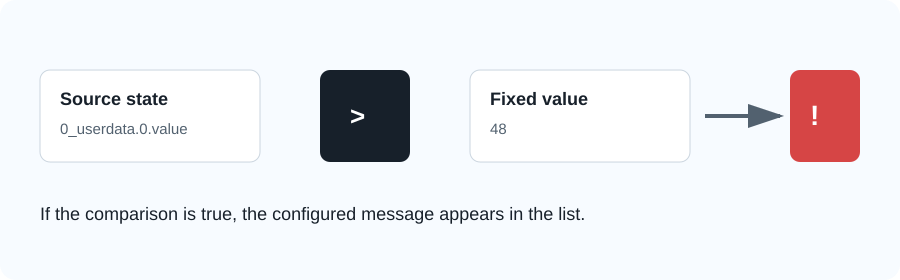
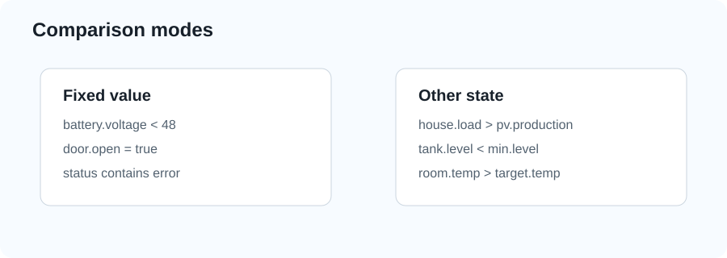
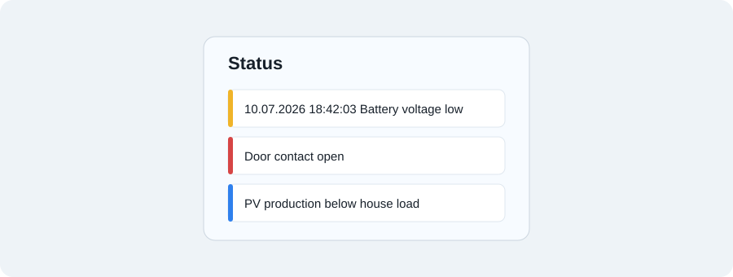

# ioBroker Statusanzeigeliste

English documentation is available here: [README.md](README.md).

Statusanzeigeliste erzeugt eine kompakte Statusmeldeliste aus konfigurierbaren ioBroker-Datenpunktvergleichen. Der Adapter ist als moderner Neubau der alten `meldungsliste`-Idee gedacht: mit jsonConfig-Oberflaeche, Analogwert-Vergleichen, Datenpunkt-gegen-Datenpunkt-Vergleichen und fertigen VIS/VIS-2 Widgets.



## Funktionen

- Beliebige ioBroker-Datenpunkte ueberwachen.
- Gegen einen festen Wert oder gegen einen anderen ioBroker-Datenpunkt vergleichen.
- Unterstuetzt `=`, `!=`, `>`, `>=`, `<`, `<=` und `contains`.
- Automatische Typerkennung oder fest `number`, `boolean` bzw. `string`.
- Geeignet fuer digitale Zustaende und analoge Werte.
- Merkt sich den Zeitpunkt, an dem eine Meldung zuerst aktiv wurde.
- Startdatum optional vor die Meldung setzen.
- Startzeit optional vor die Meldung setzen.
- Ausgabe als HTML, Klartext und JSON.
- Fertige VIS/VIS-2 Widgets enthalten.

## Ausgaben

Der Adapter legt diese States an:

| State | Beschreibung |
| --- | --- |
| `statusanzeigeliste.0.Meldungen` | HTML-Liste, kompatibel zur alten Meldungsliste-Idee. |
| `statusanzeigeliste.0.html` | HTML-Liste fuer das enthaltene Widget. |
| `statusanzeigeliste.0.text` | Klartext-Liste mit einer Meldung pro Zeile. |
| `statusanzeigeliste.0.json` | Strukturierte JSON-Liste aktiver Meldungen und Werte. |
| `statusanzeigeliste.0.info.activeCount` | Anzahl aktiver Meldungen. |
| `statusanzeigeliste.0.info.lastUpdate` | Letzte Aktualisierung. |
| `statusanzeigeliste.0.info.lastError` | Letzter Fehler bei der Regelauswertung. |

## Regelmodell

Jede Regel prueft eine Bedingung:

```text
Quell-Datenpunkt  Operator  Festwert
Quell-Datenpunkt  Operator  Vergleichs-Datenpunkt
```

Wenn die Bedingung wahr ist, erscheint der Meldungstext in der Liste. Wird die Bedingung falsch, wird die Meldung entfernt.



## Admin-Einstellungen

### Allgemein

| Option | Bedeutung |
| --- | --- |
| Statusanzeigeliste aktivieren | Aktiviert oder deaktiviert die gesamte Regelauswertung. |
| Startdatum vor Meldung anzeigen | Setzt das Datum der ersten Aktivierung vor die Meldung. Danach folgt mindestens ein Leerzeichen. |
| Startzeit vor Meldung anzeigen | Setzt die Uhrzeit der ersten Aktivierung vor die Meldung. Danach folgt mindestens ein Leerzeichen. |
| Text wenn keine Meldung aktiv ist | Optionaler Text, wenn keine Regel aktiv ist. |
| CSS-Klasse fuer Meldungszeilen | CSS-Klasse fuer die erzeugten HTML-Zeilen. Standard: `statusanzeigeliste-row`. |

Wenn Datum und Uhrzeit aktiv sind, sieht die Ausgabe so aus:

```text
10.07.2026 18:42:03 Batteriespannung zu niedrig
```

### Regeln

| Spalte | Bedeutung |
| --- | --- |
| Aktiv | Aktiviert oder deaktiviert diese Regel. |
| Name | Interner Regelname fuer Diagnose. |
| Quell-Datenpunkt | ioBroker-Datenpunkt, der ueberwacht wird. |
| Vergleich | Operator: `=`, `!=`, `>`, `>=`, `<`, `<=`, `contains`. |
| Mit | Festwert oder anderer ioBroker-Datenpunkt. |
| Festwert | Wert, wenn `Mit = Festwert` gewaehlt ist. |
| Vergleichs-Datenpunkt | Datenpunkt, wenn `Mit = Anderer Datenpunkt` gewaehlt ist. |
| Typ | `auto`, `number`, `boolean` oder `string`. |
| Prioritaet | `info`, `warning`, `error` oder `ok`; wird als CSS-Klasse im Widget genutzt. |
| Meldungstext | Text, der angezeigt wird, solange die Regel aktiv ist. |

## Vergleichsbeispiele

### Boolean-Zustand

| Feld | Wert |
| --- | --- |
| Quell-Datenpunkt | `0_userdata.0.tuer.offen` |
| Vergleich | `=` |
| Mit | Festwert |
| Festwert | `true` |
| Typ | `boolean` |
| Meldungstext | `Tuer ist offen` |

### Analog-Grenzwert

| Feld | Wert |
| --- | --- |
| Quell-Datenpunkt | `modbus.0.battery.voltage` |
| Vergleich | `<` |
| Mit | Festwert |
| Festwert | `48` |
| Typ | `number` |
| Meldungstext | `Batteriespannung unter 48 V` |

### Zwei Analogwerte vergleichen

| Feld | Wert |
| --- | --- |
| Quell-Datenpunkt | `0_userdata.0.haus.last` |
| Vergleich | `>` |
| Mit | Anderer Datenpunkt |
| Vergleichs-Datenpunkt | `0_userdata.0.pv.erzeugung` |
| Typ | `number` |
| Meldungstext | `Hausverbrauch ist hoeher als PV-Erzeugung` |



## VIS und VIS-2 Widget

Der Adapter bringt ein Widget-Set namens `statusanzeigeliste` mit.

Das Standard-Widget liest den Klartext-Ausgabestate:

```text
statusanzeigeliste.0.text
```

In VIS/VIS-2 kannst du das Widget einfuegen und optional anpassen:

| Widget-Option | Bedeutung |
| --- | --- |
| `oid` | State, der angezeigt wird. Standard: `statusanzeigeliste.0.text`. Klartext wird zeilenweise gerendert; HTML-States wie `statusanzeigeliste.0.html` werden als HTML eingefuegt. |
| `title` | Titel des Widgets. |
| `showTitle` | Zeigt oder versteckt die Titelzeile. |
| `emptyText` | Ersatztext, wenn der ausgewaehlte State leer ist. |

Das Widget nutzt CSS-Klassen je Prioritaet:

```css
.statusanzeigeliste-row.info
.statusanzeigeliste-row.warning
.statusanzeigeliste-row.error
.statusanzeigeliste-row.ok
```

Diese Klassen kannst du bei Bedarf in VIS ueberschreiben.

## Hinweise

- Die Startzeit bleibt erhalten, solange die Meldung aktiv ist. Wird die Bedingung spaeter erneut aktiv, bekommt sie eine neue Startzeit.
- Zahlenvergleiche akzeptieren Dezimalkomma und Dezimalpunkt.
- `auto` nutzt Zahlenvergleich, wenn beide Werte numerisch sind, Boolean-Vergleich bei Boolean-Werten und sonst String-Vergleich.
- `contains` vergleicht immer als Text.

## Changelog

### 0.1.0

- Erste Statusanzeigeliste mit konfigurierbaren Vergleichen und VIS/VIS-2 Widgets.

### 0.1.1

- VIS-Widget-State-Bindung korrigiert, damit der Listenwert angezeigt und aktualisiert wird.

### 0.1.2

- Bereits registrierte VIS-2 Widget-Templates werden beim Adapterstart aktualisiert.

### 0.1.3

- VIS-Widget liest standardmaessig `statusanzeigeliste.0.text`.
- Klartext-Ausgabe wird im Widget zeilenweise gerendert.

### 0.1.4

- Aktueller Widget-Wert wird direkt beim VIS-2 Template-Rendering ausgegeben.

## Lizenz

MIT

Copyright (c) 2026 TheBam1990
