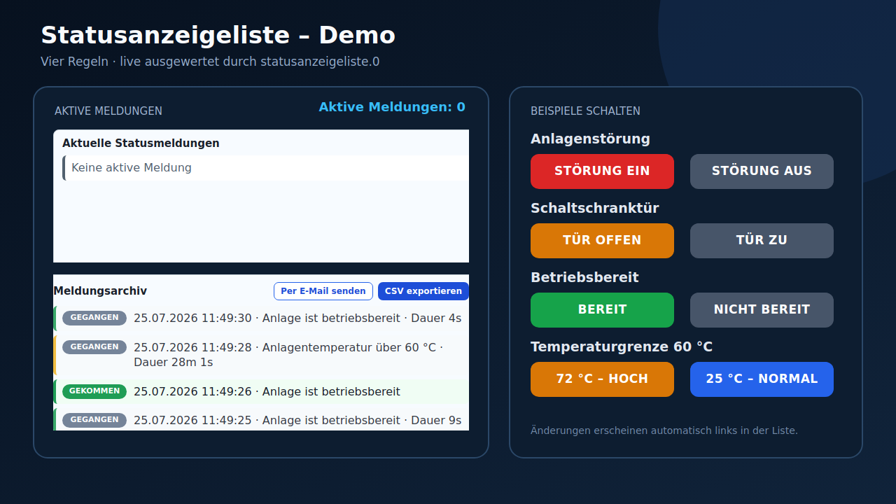

# ioBroker Statusanzeigeliste

German documentation is available here: [README.de.md](README.de.md).

Statusanzeigeliste creates a compact status message list from configurable ioBroker state comparisons. It is the successor-style rebuild of the older `meldungsliste` idea with a modern jsonConfig admin UI, analog comparisons, state-to-state comparisons and ready-to-use VIS/VIS-2 widgets.



## Requirements

- Node.js 20 or newer
- js-controller 6.0.11 or newer
- Admin 7.6.17 or newer
- VIS or VIS-2 only when the included widgets are used
- ioBroker email adapter only when email delivery is used

## Installation

Install the adapter from the ioBroker Admin adapter list once it is available in the official repository. After installation:

1. Create one adapter instance.
2. Open the instance configuration and add the required rules.
3. Save and close the configuration.
4. In VIS/VIS-2, add either **Statusanzeigeliste** or **Archiv** from the `statusanzeigeliste` widget set.


## Features

- Watch any ioBroker state.
- Compare against a fixed value or against another ioBroker state.
- Supports `=`, `!=`, `>`, `>=`, `<`, `<=` and `contains`.
- Supports automatic type detection plus explicit `number`, `boolean` or `string` comparison.
- Works with digital states and analog values.
- Keeps the first activation timestamp while a message stays active.
- Optional start date prefix.
- Optional start time prefix.
- Outputs HTML, plain text and JSON.
- Persistent coming/going message archive.
- Configurable maximum number of stored archive events.
- Includes VIS/VIS-2 widgets so no manual string widget needs to be built.

## Outputs

The adapter creates these states:

| State | Description |
| --- | --- |
| `statusanzeigeliste.0.Meldungen` | HTML list, compatible with the old message-list style. |
| `statusanzeigeliste.0.html` | HTML list for the included widget. |
| `statusanzeigeliste.0.text` | Plain text list with one message per line. |
| `statusanzeigeliste.0.json` | Structured JSON array with active messages and values. |
| `statusanzeigeliste.0.info.activeCount` | Number of active messages. |
| `statusanzeigeliste.0.info.lastUpdate` | Last rebuild time. |
| `statusanzeigeliste.0.info.lastError` | Last rule evaluation error. |
| `statusanzeigeliste.0.archive.html` | Formatted message archive as HTML. |
| `statusanzeigeliste.0.archive.text` | Message archive as plain text. |
| `statusanzeigeliste.0.archive.json` | Structured archive events as JSON. |
| `statusanzeigeliste.0.archive.csv` | Semicolon-separated CSV output for spreadsheet applications. |
| `statusanzeigeliste.0.archive.count` | Number of currently stored archive events. |
| `statusanzeigeliste.0.archive.clear` | Set to `true` to clear the archive. |
| `statusanzeigeliste.0.archive.sendEmail` | Set to `true` to send the CSV archive by email. |
| `statusanzeigeliste.0.archive.emailStatus` | Result of the latest email attempt. |
| `statusanzeigeliste.0.archive.lastEmail` | Time of the latest successful email export. |

## Rule Model

Each rule evaluates one condition:

```text
source state  operator  fixed value
source state  operator  compare state
```

If the condition is true, the configured message text appears in the list. If the condition becomes false, the message is removed.


## Admin Settings

### General

| Option | Meaning |
| --- | --- |
| Enable status list | Enables or disables all rule evaluation. |
| Show start date before message | Prepends the date when the message first became active. A space is inserted after it. |
| Show start time before message | Prepends the time when the message first became active. A space is inserted after it. |
| Text if no message is active | Optional text shown when the list is empty. |
| CSS class for message rows | CSS class used for generated HTML rows. Default: `statusanzeigeliste-row`. |
| Enable message archive | Stores a `CAME` or `GONE` event for every status transition. |
| Maximum archive entries | Limits the archive to 1 through 10,000 events. Oldest events are removed automatically. |
| Email adapter instance | Existing delivery instance, for example `email.0`. |
| Archive email recipient | Optional; when empty, the email adapter's default recipient is used. |
| Archive email subject | Subject used for archive delivery. |

If both date and time are enabled, the output looks like:

```text
10.07.2026 18:42:03 Battery voltage too low
```

### Rules

| Column | Meaning |
| --- | --- |
| Active | Enables or disables this rule. |
| Name | Internal rule name for diagnostics. |
| Source state | ioBroker state to watch. |
| Compare | Operator: `=`, `!=`, `>`, `>=`, `<`, `<=`, `contains`. |
| With | Choose fixed value or another ioBroker state. |
| Fixed value | Value used when `With = Fixed value`. |
| Compare state | State used when `With = Other state`. |
| Type | `auto`, `number`, `boolean` or `string`. |
| Severity | `info`, `warning`, `error` or `ok`; used as CSS class in the widget. |
| Message text | Text shown while the rule is active. |

## Comparison Examples

### Boolean Status

| Field | Value |
| --- | --- |
| Source state | `0_userdata.0.door.open` |
| Compare | `=` |
| With | Fixed value |
| Fixed value | `true` |
| Type | `boolean` |
| Message text | `Door is open` |

### Analog Limit

| Field | Value |
| --- | --- |
| Source state | `modbus.0.battery.voltage` |
| Compare | `<` |
| With | Fixed value |
| Fixed value | `48` |
| Type | `number` |
| Message text | `Battery voltage below 48 V` |

### Compare Two Analog States

| Field | Value |
| --- | --- |
| Source state | `0_userdata.0.house.load` |
| Compare | `>` |
| With | Other state |
| Compare state | `0_userdata.0.pv.production` |
| Type | `number` |
| Message text | `House load is higher than PV production` |


## VIS and VIS-2 Widget

The adapter ships with a widget set named `statusanzeigeliste`.

The default widget reads the plain text output state:

```text
statusanzeigeliste.0.text
```

In VIS/VIS-2 you can add the widget and optionally change:

| Widget option | Meaning |
| --- | --- |
| `oid` | State to display. Default: `statusanzeigeliste.0.text`. Plain text is rendered line by line; HTML states such as `statusanzeigeliste.0.html` are inserted as HTML. |
| `title` | Widget title. |
| `showTitle` | Shows or hides the title row. |
| `emptyText` | Fallback text if the selected state is empty. |

The widget uses CSS classes per message severity:

```css
.statusanzeigeliste-row.info
.statusanzeigeliste-row.warning
.statusanzeigeliste-row.error
.statusanzeigeliste-row.ok
```

You can override these classes in VIS if you need a project-specific design.

### Archive Widget

The widget set also contains **Statusanzeigeliste Archiv**. By default, it reads:

```text
statusanzeigeliste.0.archive.html
```

Every row shows whether a message came or went, its date, time and message text. Gone messages also show how long they were active. The archive and the start times of active messages survive adapter restarts.

Click **CSV exportieren** to download the complete currently stored archive directly in the browser. The file contains timestamp, event, severity, rule, message, source state, value and duration and can be opened with applications such as Excel or LibreOffice Calc. The export button can be hidden and its CSV state can be changed in the widget settings.

Click **Per E-Mail senden** to deliver the same CSV file through an already installed ioBroker email adapter instance. SMTP and account credentials remain exclusively in the email adapter. If no recipient is entered in Statusanzeigeliste, the email adapter's default recipient is used.

### Configure email delivery

1. Install and configure an ioBroker email adapter instance, for example `email.0`.
2. Send a test email from that adapter first.
3. Enter its instance ID in **Email adapter instance**.
4. Optionally enter a recipient and subject. An empty recipient uses the email adapter default.
5. Save the Statusanzeigeliste configuration.
6. Click **Per E-Mail senden** in the archive widget.

The result is written to `archive.emailStatus`; the latest successful delivery time is written to `archive.lastEmail`.

## Persistence and archive limits

The archive is stored in `archive.json` and restored when the adapter restarts. Start times of currently active messages are persisted separately so a restart does not create duplicate `CAME` entries. Once the configured maximum is exceeded, the oldest event is removed. The supported range is 1 through 10,000 entries.

## Troubleshooting

- If the widgets are missing in the editor, restart the adapter and reload VIS/VIS-2 without using an old editor tab.
- If the archive is empty, verify that a rule has actually changed from inactive to active or back.
- If email delivery fails, check `archive.emailStatus`, ensure the selected email instance exists and test that instance separately.
- If CSV export does not start, allow downloads for the VIS page in the browser.
- Avoid keeping multiple VIS editor tabs open; an older tab can overwrite newer project data when saved.

## Notes

- The first activation time is kept until the message disappears. If the same condition becomes active again later, a new start time is stored.
- Numeric comparison accepts decimal commas and decimal points.
- `auto` type uses number comparison if both values are numeric, boolean comparison if both values look boolean, otherwise string comparison.
- `contains` always compares as text.

## Changelog

### 0.1.0

- Initial Statusanzeigeliste adapter with configurable comparisons and VIS/VIS-2 widgets.

### 0.1.1

- Fix VIS widget state binding so the list value is displayed and updated.

### 0.1.2

- Update already registered VIS-2 widget templates during adapter startup.

### 0.1.3

- Make the VIS widget read `statusanzeigeliste.0.text` by default.
- Render plain text output line by line in the widget.

### 0.1.4

- Render the current widget value directly during VIS-2 template rendering.

### 0.2.0

- Add a persistent coming/going event archive.
- Make the maximum archive size configurable.
- Add the dedicated **Statusanzeigeliste Archiv** VIS/VIS-2 widget.
- Provide HTML, plain-text and JSON archive outputs plus a clear state.

### 0.2.1

- Add CSV output for the message archive.
- Add a direct browser download button to the archive widget.

### 0.2.2

- Send the CSV archive through an existing ioBroker email adapter.
- Add a **Per E-Mail senden** button to the archive widget.
- Add configurable email instance, recipient and subject.

### 0.2.3

- Make browser CSV download work without an additional VIS-2 state subscription.

### 0.2.4

- Prepare package metadata, CI and documentation for the official ioBroker repository.
- Add a real VIS-2 example screenshot and detailed installation, email and troubleshooting instructions.

## License

MIT

Copyright (c) 2026 TheBam1990
